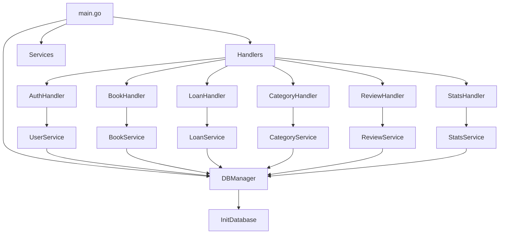

# Book Management System

A Go-based library management system with user authentication and book tracking capabilities.

## System Architecture

### Function Call Graph


### Components

#### Handlers
- `AuthHandler`: Manages user authentication and sessions
- `BookHandler`: Handles book-related operations (CRUD)
- `LoanHandler`: Manages book loans and returns
- `CategoryHandler`: Handles book categories
- `ReviewHandler`: Manages book reviews
- `StatsHandler`: Provides system statistics

#### Services
- `UserService`: User management and authentication
- `BookService`: Book inventory management
- `LoanService`: Loan tracking and management
- `CategoryService`: Category management
- `ReviewService`: Review management
- `StatsService`: Statistical calculations

#### Database
- SQLite database with tables for:
  - Users
  - Books
  - Loans
  - Categories
  - Reviews

## API Endpoints

### Authentication
- `POST /api/login`: User login
- `POST /api/logout`: User logout

### Books
- `GET /api/books`: List all books
- `POST /api/books`: Add new book
- `GET /api/books/{id}`: Get book details
- `PUT /api/books/{id}`: Update book
- `DELETE /api/books/{id}`: Delete book

### Loans
- `GET /api/loans`: List user's loans
- `POST /api/loans`: Create new loan
- `POST /api/loans/{id}/return`: Return a book
- `GET /api/loans/overdue`: List overdue loans (admin only)

### Categories
- `GET /api/categories`: List categories
- `POST /api/categories`: Add category
- `PUT /api/categories/{id}`: Update category
- `DELETE /api/categories/{id}`: Delete category

### Reviews
- `GET /api/books/{id}/reviews`: Get book reviews
- `POST /api/books/{id}/reviews`: Add review
- `GET /api/users/{id}/reviews`: Get user's reviews

## Setup

1. Install dependencies:
```bash
go mod tidy
```

2. Set up the database:
```bash
# Database will be automatically initialized on first run
```

3. Run the server:
```bash
go run cmd/api/main.go
```

## Default Admin Account
- Username: `admin`
- Password: `admin123` 

## Frontend Structure

### HTML Templates
```
web/templates/
├── index.html      # Landing page
├── login.html      # Login form
├── books.html      # Book listing and management
├── loans.html      # User's loans
├── admin/
    ├── books.html  # Admin book management
    ├── users.html  # User management
    └── stats.html  # System statistics
```

### JavaScript Functions (web/static/js/main.js)
```javascript
// Authentication
async function handleLogin(event) { /* ... */ }
async function handleLogout() { /* ... */ }
async function checkAuthStatus() { /* ... */ }

// Books
async function loadBooks() { /* ... */ }
async function searchBooks(query) { /* ... */ }
async function addBook(bookData) { /* ... */ }
async function deleteBook(bookId) { /* ... */ }
async function updateBook(bookId, bookData) { /* ... */ }

// Loans
async function loadLoans() { /* ... */ }
async function borrowBook(bookId) { /* ... */ }
async function returnBook(loanId) { /* ... */ }

// Reviews
async function loadReviews(bookId) { /* ... */ }
async function addReview(bookId, reviewData) { /* ... */ }

// Admin Functions
async function loadUsers() { /* ... */ }
async function loadStats() { /* ... */ }
```

### Required Updates

1. **Login Page (login.html)**
   - Add login form
   - Handle form submission
   - Show error messages
   - Redirect after successful login

2. **Books Page (books.html)**
   - Display book grid
   - Add search functionality
   - Add borrow button for each book
   - Show book details modal
   - Add review functionality

3. **Loans Page (loans.html)**
   - Show user's active loans
   - Add return button
   - Display loan status
   - Show due dates

4. **Admin Pages**
   - Book management (CRUD operations)
   - User management
   - System statistics
   - Overdue loans report

### CSS Structure (web/static/css/style.css)
```css
/* Layout */
.container { /* ... */ }
.navbar { /* ... */ }

/* Components */
.book-card { /* ... */ }
.loan-card { /* ... */ }
.modal { /* ... */ }

/* Forms */
.form-group { /* ... */ }
.btn-primary { /* ... */ }

/* Utilities */
.error-message { /* ... */ }
.success-message { /* ... */ }
```

### Implementation Order

1. **Basic Authentication**
   ```javascript
   // main.js
   async function handleLogin(event) {
       event.preventDefault();
       const username = document.getElementById('username').value;
       const password = document.getElementById('password').value;
       
       try {
           const response = await fetch('/api/login', {
               method: 'POST',
               headers: { 'Content-Type': 'application/json' },
               body: JSON.stringify({ username, password })
           });
           
           if (response.ok) {
               window.location.href = '/books';
           } else {
               showError('Invalid credentials');
           }
       } catch (error) {
           showError('Login failed');
       }
   }
   ```

2. **Book Listing**
   ```javascript
   // main.js
   async function loadBooks() {
       try {
           const response = await fetch('/api/books');
           const data = await response.json();
           
           const booksGrid = document.getElementById('booksGrid');
           booksGrid.innerHTML = '';
           
           data.data.forEach(book => {
               const bookCard = createBookCard(book);
               booksGrid.appendChild(bookCard);
           });
       } catch (error) {
           showError('Failed to load books');
       }
   }
   ```

3. **Loan Management**
   ```javascript
   // main.js
   async function borrowBook(bookId) {
       try {
           const response = await fetch('/api/loans', {
               method: 'POST',
               headers: { 'Content-Type': 'application/json' },
               body: JSON.stringify({ book_id: bookId })
           });
           
           if (response.ok) {
               showSuccess('Book borrowed successfully');
               loadBooks();
           }
       } catch (error) {
           showError('Failed to borrow book');
       }
   }
   ```

### Next Steps

1. Create the basic HTML templates
2. Implement the core JavaScript functions
3. Style the components with CSS
4. Add admin functionality
5. Implement error handling and validation
6. Add loading states and feedback
7. Test user flows and fix bugs

Would you like me to provide more details about any specific part?