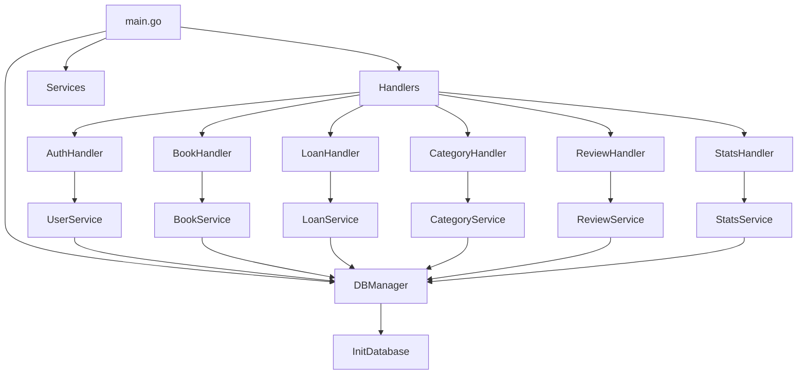

# Book Management System

A Go-based library management system with user authentication and book tracking capabilities.

## System Architecture

### Function Call Graph


### Components

#### Handlers
- `AuthHandler`: Manages user authentication and sessions
- `BookHandler`: Handles book-related operations (CRUD)
- `LoanHandler`: Manages book loans and returns
- `CategoryHandler`: Handles book categories
- `ReviewHandler`: Manages book reviews
- `StatsHandler`: Provides system statistics

#### Services
- `UserService`: User management and authentication
- `BookService`: Book inventory management
- `LoanService`: Loan tracking and management
- `CategoryService`: Category management
- `ReviewService`: Review management
- `StatsService`: Statistical calculations

#### Database
- SQLite database with tables for:
  - Users
  - Books
  - Loans
  - Categories
  - Reviews

## API Endpoints

### Authentication
- `POST /api/login`: User login
- `POST /api/logout`: User logout

### Books
- `GET /api/books`: List all books
- `POST /api/books`: Add new book
- `GET /api/books/{id}`: Get book details
- `PUT /api/books/{id}`: Update book
- `DELETE /api/books/{id}`: Delete book

### Loans
- `GET /api/loans`: List user's loans
- `POST /api/loans`: Create new loan
- `POST /api/loans/{id}/return`: Return a book
- `GET /api/loans/overdue`: List overdue loans (admin only)

### Categories
- `GET /api/categories`: List categories
- `POST /api/categories`: Add category
- `PUT /api/categories/{id}`: Update category
- `DELETE /api/categories/{id}`: Delete category

### Reviews
- `GET /api/books/{id}/reviews`: Get book reviews
- `POST /api/books/{id}/reviews`: Add review
- `GET /api/users/{id}/reviews`: Get user's reviews

## Setup

1. Install dependencies:
```bash
go mod tidy
```

2. Set up the database:
```bash
# Database will be automatically initialized on first run
```

3. Run the server:
```bash
go run cmd/api/main.go
```

## Default Admin Account
- Username: `admin`
- Password: `admin123` 

## Frontend Structure

### HTML Templates
```
web/templates/
├── index.html      # Landing page
├── login.html      # Login form
├── books.html      # Book listing and management
├── loans.html      # User's loans
├── admin/
    ├── books.html  # Admin book management
    ├── users.html  # User management
    └── stats.html  # System statistics
```

### JavaScript Functions (web/static/js/main.js)
```javascript
// Authentication
async function handleLogin(event) { /* ... */ }
async function handleLogout() { /* ... */ }
async function checkAuthStatus() { /* ... */ }

// Books
async function loadBooks() { /* ... */ }
async function searchBooks(query) { /* ... */ }
async function addBook(bookData) { /* ... */ }
async function deleteBook(bookId) { /* ... */ }
async function updateBook(bookId, bookData) { /* ... */ }

// Loans
async function loadLoans() { /* ... */ }
async function borrowBook(bookId) { /* ... */ }
async function returnBook(loanId) { /* ... */ }

// Reviews
async function loadReviews(bookId) { /* ... */ }
async function addReview(bookId, reviewData) { /* ... */ }

// Admin Functions
async function loadUsers() { /* ... */ }
async function loadStats() { /* ... */ }
```

### Required Updates

1. **Login Page (login.html)**
   - Add login form
   - Handle form submission
   - Show error messages
   - Redirect after successful login

2. **Books Page (books.html)**
   - Display book grid
   - Add search functionality
   - Add borrow button for each book
   - Show book details modal
   - Add review functionality

3. **Loans Page (loans.html)**
   - Show user's active loans
   - Add return button
   - Display loan status
   - Show due dates

4. **Admin Pages**
   - Book management (CRUD operations)
   - User management
   - System statistics
   - Overdue loans report

### CSS Structure (web/static/css/style.css)
```css
/* Layout */
.container { /* ... */ }
.navbar { /* ... */ }

/* Components */
.book-card { /* ... */ }
.loan-card { /* ... */ }
.modal { /* ... */ }

/* Forms */
.form-group { /* ... */ }
.btn-primary { /* ... */ }

/* Utilities */
.error-message { /* ... */ }
.success-message { /* ... */ }
```

### Implementation Order

1. **Basic Authentication**
   ```javascript
   // main.js
   async function handleLogin(event) {
       event.preventDefault();
       const username = document.getElementById('username').value;
       const password = document.getElementById('password').value;
       
       try {
           const response = await fetch('/api/login', {
               method: 'POST',
               headers: { 'Content-Type': 'application/json' },
               body: JSON.stringify({ username, password })
           });
           
           if (response.ok) {
               window.location.href = '/books';
           } else {
               showError('Invalid credentials');
           }
       } catch (error) {
           showError('Login failed');
       }
   }
   ```

2. **Book Listing**
   ```javascript
   // main.js
   async function loadBooks() {
       try {
           const response = await fetch('/api/books');
           const data = await response.json();
           
           const booksGrid = document.getElementById('booksGrid');
           booksGrid.innerHTML = '';
           
           data.data.forEach(book => {
               const bookCard = createBookCard(book);
               booksGrid.appendChild(bookCard);
           });
       } catch (error) {
           showError('Failed to load books');
       }
   }
   ```

3. **Loan Management**
   ```javascript
   // main.js
   async function borrowBook(bookId) {
       try {
           const response = await fetch('/api/loans', {
               method: 'POST',
               headers: { 'Content-Type': 'application/json' },
               body: JSON.stringify({ book_id: bookId })
           });
           
           if (response.ok) {
               showSuccess('Book borrowed successfully');
               loadBooks();
           }
       } catch (error) {
           showError('Failed to borrow book');
       }
   }
   ```

### Next Steps

1. Create the basic HTML templates
2. Implement the core JavaScript functions
3. Style the components with CSS
4. Add admin functionality
5. Implement error handling and validation
6. Add loading states and feedback
7. Test user flows and fix bugs

# Frontend Development Guide

## Template Structure and Asset Integration

### HTML Templates Organization
```
web/templates/
├── index.html      # Landing page
├── login.html      # Login form
├── books.html      # Book listing
└── admin/          # Admin section templates
    └── ...
```

### Embedding CSS and JavaScript

1. **CSS Integration**
```html
<head>
    <!-- Required meta tags -->
    <meta charset="UTF-8">
    <meta name="viewport" content="width=device-width, initial-scale=1.0">
    
    <!-- Third-party CSS (load first) -->
    <link href="https://cdn.jsdelivr.net/npm/bootstrap@5.3.0/dist/css/bootstrap.min.css" rel="stylesheet">
    
    <!-- Custom CSS (load last to override) -->
    <link rel="stylesheet" href="/static/css/style.css">
</head>
```

2. **JavaScript Integration**
```html
<body>
    <!-- Content here -->

    <!-- Third-party JS (load first) -->
    <script src="https://code.jquery.com/jquery-3.6.0.min.js"></script>
    
    <!-- Custom JS (load last) -->
    <script src="/static/js/main.js"></script>
</body>
```

3. **Best Practices**
- Load CSS in the `<head>` to prevent FOUC (Flash of Unstyled Content)
- Load JS just before closing `</body>` for better page load performance
- Use async/defer for non-critical scripts:
  ```html
  <script async src="non-critical.js"></script>
  <script defer src="deferred.js"></script>
  ```

### Static Files Structure
```
web/static/
├── css/
│   ├── style.css          # Main styles
│   └── admin.css          # Admin-specific styles
├── js/
│   ├── main.js            # Core functionality
│   ├── books.js           # Book-related functions
│   └── admin.js           # Admin functions
└── img/                   # Image assets
```

### Loading Order
1. Meta tags
2. Third-party CSS
3. Custom CSS
4. HTML content
5. Third-party JavaScript
6. Custom JavaScript

### Example Template
```html
<!DOCTYPE html>
<html>
<head>
    <meta charset="UTF-8">
    <meta name="viewport" content="width=device-width, initial-scale=1.0">
    <title>Book System</title>
    
    <!-- Third-party CSS -->
    <link href="https://cdn.jsdelivr.net/npm/bootstrap@5.3.0/dist/css/bootstrap.min.css" rel="stylesheet">
    
    <!-- Custom CSS -->
    <link rel="stylesheet" href="/static/css/style.css">
</head>
<body>
    <!-- Content here -->

    <!-- Third-party JS -->
    <script src="https://code.jquery.com/jquery-3.6.0.min.js"></script>
    <script src="https://cdn.jsdelivr.net/npm/bootstrap@5.3.0/dist/js/bootstrap.bundle.min.js"></script>
    
    <!-- Custom JS -->
    <script src="/static/js/main.js"></script>
</body>
</html>
```

# Data Seeding Guide

## Using Open APIs for Book Data

### Available Book APIs
1. **Google Books API**
   ```bash
   https://www.googleapis.com/books/v1/volumes?q=subject:programming
   ```

2. **Open Library API**
   ```bash
   https://openlibrary.org/api/books?bibkeys=ISBN:0451526538
   ```

### Sample Seeding Script

```go:book-system/cmd/seeder/main.go
package main

import (
    "encoding/json"
    "fmt"
    "net/http"
    "log"
    "booksystem/internal/db"
    "booksystem/internal/models"
)

type GoogleBooksResponse struct {
    Items []struct {
        VolumeInfo struct {
            Title       string   `json:"title"`
            Authors    []string `json:"authors"`
            Publisher  string   `json:"publisher"`
            ISBN13     []string `json:"industryIdentifiers"`
            PageCount  int      `json:"pageCount"`
            Categories []string `json:"categories"`
        } `json:"volumeInfo"`
    } `json:"items"`
}

func main() {
    // Initialize DB
    dbManager, err := db.NewManager("books.db")
    if err != nil {
        log.Fatal(err)
    }

    // Fetch books from Google Books API
    resp, err := http.Get("https://www.googleapis.com/books/v1/volumes?q=subject:programming&maxResults=40")
    if err != nil {
        log.Fatal(err)
    }
    defer resp.Body.Close()

    var result GoogleBooksResponse
    if err := json.NewDecoder(resp.Body).Decode(&result); err != nil {
        log.Fatal(err)
    }

    // Insert books into database
    for _, item := range result.Items {
        book := &models.Book{
            Title:    item.VolumeInfo.Title,
            Author:   item.VolumeInfo.Authors[0],
            ISBN:     "N/A",
            Stock:    5,
            Category: item.VolumeInfo.Categories[0],
        }
        
        if err := dbManager.BookService.Create(book); err != nil {
            log.Printf("Error creating book %s: %v", book.Title, err)
            continue
        }
        fmt.Printf("Added book: %s\n", book.Title)
    }
}
```

### Running the Seeder

1. **Build and Run**
```bash
go run cmd/seeder/main.go
```

2. **Alternative APIs**
- OpenLibrary: `https://openlibrary.org/api/books`
- ISBNdb: Requires API key
- WorldCat: Requires API key

### Sample API Calls

1. **Google Books API**
```go
func fetchFromGoogleBooks(query string) ([]models.Book, error) {
    url := fmt.Sprintf("https://www.googleapis.com/books/v1/volumes?q=%s", query)
    resp, err := http.Get(url)
    if err != nil {
        return nil, err
    }
    defer resp.Body.Close()

    var result GoogleBooksResponse
    if err := json.NewDecoder(resp.Body).Decode(&result); err != nil {
        return nil, err
    }

    var books []models.Book
    for _, item := range result.Items {
        book := models.Book{
            Title:  item.VolumeInfo.Title,
            Author: strings.Join(item.VolumeInfo.Authors, ", "),
            Stock:  5,
        }
        books = append(books, book)
    }
    return books, nil
}
```

2. **Open Library API**
```go
func fetchFromOpenLibrary(isbn string) (*models.Book, error) {
    url := fmt.Sprintf("https://openlibrary.org/api/books?bibkeys=ISBN:%s&format=json", isbn)
    resp, err := http.Get(url)
    if err != nil {
        return nil, err
    }
    defer resp.Body.Close()

    var result map[string]interface{}
    if err := json.NewDecoder(resp.Body).Decode(&result); err != nil {
        return nil, err
    }

    // Parse response and create book
    // ...
    return book, nil
}
```

### Periodic Updates
You can set up a cron job to update book data periodically:

```go
func updateBookData() {
    c := cron.New()
    c.AddFunc("0 0 * * *", func() {  // Run daily at midnight
        books, err := fetchFromGoogleBooks("programming")
        if err != nil {
            log.Printf("Error fetching books: %v", err)
            return
        }
        // Update database
        // ...
    })
    c.Start()
}
```

### Error Handling
- Handle API rate limits
- Implement retries for failed requests
- Log errors and successes
- Skip duplicate books
- Validate data before insertion

# Book Content Crawler Guide

## Free Sources with Full Content

### 1. Project Gutenberg
- 60,000+ free books
- Public domain
- Multiple formats (TXT, HTML, EPUB)
- Well-structured catalog
- No API key needed

### 2. Internet Archive
- Millions of books
- Public domain section
- Multiple formats
- Structured metadata

## Implementation

### 1. Database Schema Update
```sql
CREATE TABLE books (
    id INTEGER PRIMARY KEY AUTOINCREMENT,
    title TEXT NOT NULL,
    author TEXT NOT NULL,
    content_path TEXT,        -- Path to stored content
    format TEXT,             -- epub, txt, pdf
    language TEXT,
    release_date TEXT,
    download_count INTEGER DEFAULT 0,
    file_size INTEGER,
    created_at DATETIME DEFAULT CURRENT_TIMESTAMP,
    updated_at DATETIME DEFAULT CURRENT_TIMESTAMP
);
```

### 2. Crawler Implementation
```go
package crawler

import (
    "encoding/xml"
    "io"
    "net/http"
    "os"
    "path/filepath"
)

type GutenbergBook struct {
    Title    string `xml:"title"`
    Author   string `xml:"creator"`
    Language string `xml:"language"`
    Rights   string `xml:"rights"`
    Subject  string `xml:"subject"`
    Link     struct {
        Href string `xml:"href,attr"`
    } `xml:"link"`
}

func DownloadBook(url, destPath string) error {
    resp, err := http.Get(url)
    if err != nil {
        return err
    }
    defer resp.Body.Close()

    out, err := os.Create(destPath)
    if err != nil {
        return err
    }
    defer out.Close()

    _, err = io.Copy(out, resp.Body)
    return err
}

func FetchAndStoreBook(bookID int) (*models.Book, error) {
    // Fetch metadata
    metadataURL := fmt.Sprintf(
        "https://www.gutenberg.org/cache/epub/%d/pg%d.rdf",
        bookID, bookID
    )
    
    resp, err := http.Get(metadataURL)
    if err != nil {
        return nil, err
    }
    defer resp.Body.Close()

    var book GutenbergBook
    if err := xml.NewDecoder(resp.Body).Decode(&book); err != nil {
        return nil, err
    }

    // Create storage directory
    storageDir := "storage/books"
    if err := os.MkdirAll(storageDir, 0755); err != nil {
        return nil, err
    }

    // Download book content (txt format)
    txtURL := fmt.Sprintf(
        "https://www.gutenberg.org/files/%d/%d-0.txt",
        bookID, bookID
    )
    contentPath := filepath.Join(storageDir, fmt.Sprintf("%d.txt", bookID))
    
    if err := DownloadBook(txtURL, contentPath); err != nil {
        return nil, err
    }

    return &models.Book{
        Title:       book.Title,
        Author:      book.Author,
        ContentPath: contentPath,
        Format:      "txt",
        Language:    book.Language,
        Rights:      book.Rights,
    }, nil
}
```

### 3. Content Storage Manager
```go
type ContentManager struct {
    baseDir string
}

func NewContentManager(baseDir string) *ContentManager {
    return &ContentManager{baseDir: baseDir}
}

func (cm *ContentManager) Store(bookID int, content io.Reader) (string, error) {
    // Create year/month based directory structure
    now := time.Now()
    relPath := filepath.Join(
        strconv.Itoa(now.Year()),
        strconv.Itoa(int(now.Month())),
        fmt.Sprintf("%d.txt", bookID),
    )
    
    absPath := filepath.Join(cm.baseDir, relPath)
    
    if err := os.MkdirAll(filepath.Dir(absPath), 0755); err != nil {
        return "", err
    }

    file, err := os.Create(absPath)
    if err != nil {
        return "", err
    }
    defer file.Close()

    if _, err := io.Copy(file, content); err != nil {
        return "", err
    }

    return relPath, nil
}

func (cm *ContentManager) Read(path string) (io.ReadCloser, error) {
    return os.Open(filepath.Join(cm.baseDir, path))
}
```

### 4. Usage Example
```go
func main() {
    // Initialize managers
    dbManager, _ := db.NewManager("books.db")
    contentManager := NewContentManager("storage/books")

    // Fetch and store books
    for bookID := 1000; bookID < 1100; bookID++ {
        book, err := FetchAndStoreBook(bookID)
        if err != nil {
            log.Printf("Error fetching book %d: %v", bookID, err)
            continue
        }

        // Save to database
        if err := dbManager.BookService.Create(book); err != nil {
            log.Printf("Error saving book %s: %v", book.Title, err)
            continue
        }

        log.Printf("Saved book: %s", book.Title)
    }
}
```

### 5. Reading Content
```go
func GetBookContent(bookID int) (string, error) {
    book, err := dbManager.BookService.GetByID(bookID)
    if err != nil {
        return "", err
    }

    content, err := contentManager.Read(book.ContentPath)
    if err != nil {
        return "", err
    }
    defer content.Close()

    data, err := io.ReadAll(content)
    if err != nil {
        return "", err
    }

    return string(data), nil
}
```

## Features
1. Downloads and stores full book content
2. Organizes files by date
3. Handles multiple formats
4. Includes metadata
5. Efficient storage management
6. Error handling and logging

## Limitations
1. Only public domain books
2. Some books might have OCR errors
3. Limited to available formats
4. Network dependency

## Best Practices
1. Implement rate limiting
2. Add error recovery
3. Use content validation
4. Implement caching
5. Monitor storage usage